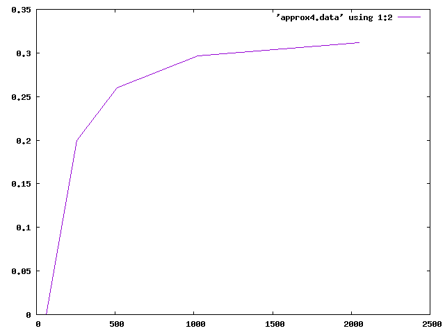
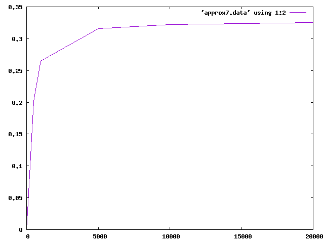

% Тестирование pkt_{sender,receiver}

## Параметры тестирования

| Параметр       | Описание                                  |
|----------------|-------------------------------------------|
| proto          | Протокол (TCP/UDP)                        |
| num\_pkts      | Количество пакетов в batch                |
| pkt\_size      | Размер пакета                             |
| process\_delay | Задержка при обработке                    |
| send\_delay    | Задержка между отправкой пакетов          |
| ring\_size     | Размер кольцевого буфера (степень двойки) |
| num_tests      | Количество запусков для теста             |

## Тесты

Полные конфигурации тестов доступны в [самом скрипте](../test.sh)

### Протокол TCP
1. `pkt_size=1000, num_pkts=30, process_delay="10 100 1000", send_delay="10 100 1000",
ring_size="8 16 128"`

Базовый тест,  показывающий, что количество потерь (10% -> 0) зависит от размера
кольцевого буфера (8->16)

[Протокол запуска](../test_data/test.out.approx1)

2. `pkt_size=1000, num_pkts=40 process_delay=150, num_tests=5, ring_size="8 32 128"`

Проверка вышеуказанной зависимости, увеличиваем размер кольцевого буфера
(8 -> 32) и отсутствуют потери (15% -> 0%)

[Протокол запуска](../test_data/test.out.approx2)

3. `num_pkts="32 64 256", ring_size="16 32 128"`

Очередной простой тест на зависимость

[Протокол запуска](../test_data/test.out.approx3)

4. `num_pkts="16 32 64 256 512 1024 2048", ring_size=32, pkt_size=1000, send_delay=5,
process_delay=150, num_tests=3`

Тестируем зависимость потери от количества посылаемых пакетов:

[Протокол запуска](../test_data/test.out.approx4)



Это логарифмическая зависимость, которая стремится к 0.(3)

Время запуска: 5:03

5. `process_delay = "50 100 300 500 1500"` (остальные характеристики повторяют тест 4)

[Протокол запуска](../test_data/test.out.approx5)

Фиксированная потеря пакетов (274): отсутствует завимиость от `process_delay`

Время запуска: 3:48

```
# 2022-08-30 16:17:53 pkt_size = 1000 num_pkts = 512 snd_delay = 5 rcv_delay = 50 rng_size = 32 
# 274 750 0.267578
```

6. `send_delay = "50 100 300 500 1500"` (повторяет тест 5 для `send_delay`)

[Протокол запуска](../test_data/test.out.approx6)

Фиксированная потеря пакетов (106): отсутствует завимиость от `process_delay`

7. `num_pkts="500 1000 5000 10000 15000 20000", ring_size=32, pkt_size=1000, send_delay=5,
process_delay=150, num_tests=3`

Повтор теста 4 с другой гланулярностью для `num_pkts`.

Время запуска: 53:47

[Протокол запуска](../test_data/test.out.approx7)



Имеем такое же логарифмическое поведение.

8. `pkt_size = 600` (повторяет тест 7 с уменьшенным размером пакета)

Время запуска: 17:41

[Протокол запуска](../test_data/test.out.approx8)

Отсутствует зависимость от размера пакета.

9. Фиксируем `pkt_size` (предыдущий тест), `ring_size="64 512 4096", num_pkts="500 1000 5000"`

Время запуска: 8:17

[Протокол запуска](../test_data/test.out.approx9)

Результаты:

| num_pkts<br>ring_size | 500 | 1000 | 5000 |
|-----------------------|-----|------|------|
| 64                    | 202 | 531  | 3158 |
| 512                   | 0   | 0    | 2707 |
| 4096                  | 0   | 0    | 0    |

10. Фиксируем `rng_size=4096, pkt_size=600`, изменяем `num_pkts="5000 10000 15000 20000"`

Время запуска: 20:55

[Протокол запуска](../test_data/test.out.approx10)

Результаты:

| num_pkts | packet loss  | time (sec) |
|----------|--------------|------------|
| 5000     | 0            | 152        |
| 10000    | 2410 (12%)   | 266        |
| 15000    | 5694 (19%)   | 368        |
| 20000    | 8978 (22.5%) | 491        |

### Протокол UDP

Произведём запуск некоторых тестов для протокола UDP. Существенных отличий в данном окружении
быть не должно - проверим.

1. Для теста 4 имеем сходные результаты.

[Протокол запуска](../test_data/test.out.approx4_udp)

Время запуска: 5:00 (5:03 для TCP)


Результаты совпадают:

| num_pkts | loss (TCP) | loss (UDP) |
|----------|------------|------------|
| 64       | 0.207031   | 0.207031   |
| 256      | 0.267852   | 0.267578   |
| 512      | 0.297852   | 0.297852   |
| 1024     | 0.312988   | 0.313232   |

2. Для теста 7 имеем сходные результаты (32.5% против 32.2% потерь для 20000 пакетов и UDP/TCP)

[Протокол запуска](../test_data/test.out.approx7_udp)


| num_pkts | loss (TCP) | loss (UDP) |
|----------|------------|------------|
| 500      | 0.202      | 0.202      |
| 1000     | 0.265      | 0.2655     |
| 5000     | 0.3158     | 0.3158     |
| 10000    | 0.322      | 0.32       |
| 15000    | 0.3241     | 0.32       |
| 20000    | 0.325125   | 0.32265    |

3. Для теста 10

[Протокол запуска](../test_data/test.out.approx10_udp)

Время запуска: 20:54 (20:55 для TCP)

Результаты практически совпадают:

| num_pkts | packet loss  | time (sec) |
|----------|--------------|------------|
| 5000     | 0            | 152        |
| 10000    | 2425 (12%)   | 266        |
| 15000    | 5681 (19%)   | 367        |
| 20000    | 9012 (22.5%) | 469        |

``` {=html}
<style>
body { min-width: 80% !important; }
</style>
```

